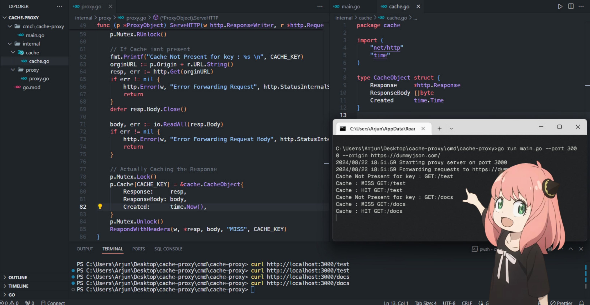

## Caching Proxy Server
Cache Proxy is a simple, bare-bones caching proxy server implemented in Go. It serves as a basic solution for caching HTTP requests and responses, using an in-memory map to store the cache.

## Features
- In-Memory Caching:
  - The server uses an in-memory map to store cached responses. This approach allows for fast lookups and reduces the time needed to retrieve cached data.

- Proxy Functionality:
  - The server forwards client requests to the target server and caches the responses. If the same request is made again, the server returns the cached response, saving the time and resources of making a new request to the target server.

- Simple Design:
  - This is a minimalistic implementation aimed at demonstrating the core concepts of a caching proxy server. It is not suitable for production use without further enhancements.

## Usage

### Start the server:

```bash
go run cmd/cache-proxy/main.go --port <PORT> --origin <ORIGIN_URL>
```
### To clear the cache::

```bash
go run cmd/cache-proxy/main.go --clear-cache
```
## Limitations
### Memory Usage:

Since the cache is stored in memory, it is limited by the available RAM. For large-scale use cases, consider implementing a more sophisticated caching mechanism that can handle larger datasets or persist the cache to disk.

### No Cache Eviction Policy:

This implementation does not include a cache eviction policy. The cache will grow indefinitely, which could lead to memory exhaustion in long-running scenarios. Adding an eviction policy like LRU (Least Recently Used) would be a recommended enhancement.

## Future Improvements
1. Cache Persistence:
Implementing a mechanism to persist the cache to disk would allow the server to maintain the cache across restarts.
2. Cache Expiry:
Introducing cache expiry times for the stored responses would ensure that outdated data is not served to clients.
3. Concurrency Handling:
Enhancing the server to handle concurrent requests more efficiently would improve its performance in multi-client environments.

## Conclusion
This is a minimal implementation intended as a starting point for more complex caching proxy solutions.

## Extras
This Repo serves as a solution to [Roadmap.sh Caching Server Problem](https://roadmap.sh/projects/caching-server)